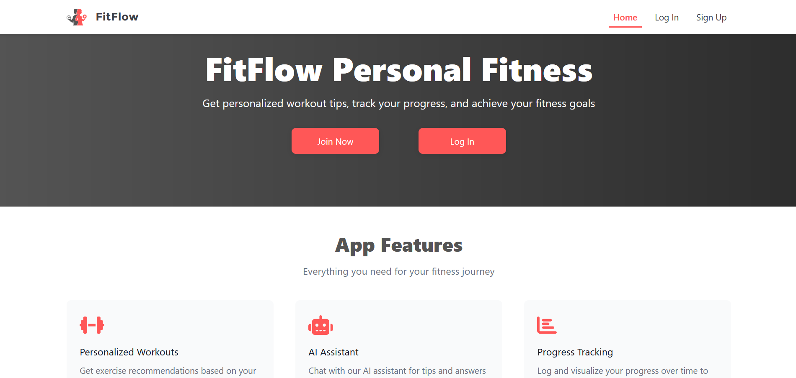

# FullStack - FitFlow App

## Descripción general

Carpeta backend y frontend de la aplicación FitFlow, desarrollado con Next.js y TypeScript. Contiene la carpeta backend para proporcionar los datos.

## Estructura del proyecto

````
backend/ 
├── docs/ # Documentación de la API (Swagger) 
├── src/ # Código fuente principal 
│ ├── api/ # Controladores, rutas, middlewares 
│ ├── config/ # Configuración de la app 
│ ├── constants/ # Constantes globales 
│ ├── interfaces/ # Interfaces de TypeScript 
│ ├── models/ # Modelos de datos 
│ ├── responses/ # Respuestas estandarizadas de la API  
│ ├── schemas/ # Esquemas de validación 
│ ├── services/ # Lógica de negocio 
│ ├── tests/ # Pruebas unitarias e integración 
│ ├── utils/ # Funciones utilitarias 
├── package.json # Dependencias y scripts 
├── tsconfig.json # Configuración de TypeScript
````

```
frontend/
├── app/ # Páginas principales y layouts 
├── components/ # Componentes reutilizables 
├── hooks/ # Hooks personalizados 
├── services/ # Servicios para interactuar con la API ├── styles/ # Estilos globales y configuraciones de Tailwind CSS 
├── public/ # Archivos estáticos 
├── package.json # Dependencias y scripts 
├── tsconfig.json # Configuración de TypeScript 
├── shared/ # Interfaces y tipos compartidos entre frontend y backend` 
```

## Requisitos previos

-   Node.js (v16 o superior)
    
-   npm o yarn
    

## Configuración

1.  Clona el repositorio:
    
    `git clone https://github.com/nuriadevs/fitflow-fullstack cd fitflow-fullstack` 
    
2.  Instala las dependencias:
    
    `npm install` 
    

## Scripts

### Backend

-   `npm start`: Inicia el servidor.
    

### Frontend

-   `npm run dev`: Inicia el servidor de desarrollo.
    
-   `npm run build`: Genera una versión optimizada para producción.
    

## Variables de entorno

1.  Crea un archivo `.env.local` en la raíz del proyecto con la siguiente variable:
    

### Frontend

`NEXT_PUBLIC_API_URL=<API_URL>` 

### Backend

```
DATABASE_URL=<DATABASE_URL> 
JWT_SECRET=<JWT_SECRET> 
OPENAI_API_KEY=<TU_API_KEY_DE_OPENAI> 
MONGODB_URI=<URI_DE_CONEXIÓN_A_MONGODB> 
PORT=<PUERTO_DEL_SERVIDOR> 
CORS_ORIGIN=<ORIGEN_PERMITIDO> 
NODE_ENV=<ENTORNO> 
UPSTASH_VECTOR_REST_URL=<VECTOR_REST_URL> 
UPSTASH_VECTOR_REST_TOKEN=<UPSTASH_TOKEN>` 
```

2.  Configura opciones adicionales en `next.config.js` si es necesario.
    

## Estilos

Este proyecto usa Tailwind CSS para los estilos. Puedes personalizar la configuración en el archivo `tailwind.config.js`.

## Pruebas

### Backend

`npm test` 

### Frontend

Actualmente, no se han configurado pruebas. Se recomienda usar Jest o React Testing Library para agregar pruebas unitarias e integradas.

## Comunicación entre Backend y Frontend

El frontend interactúa con el backend a través de una API REST, manejando la autenticación con tokens JWT y actualizando la interfaz de usuario según las respuestas del servidor.

El backend y el frontend trabajan juntos para cumplir **un solo objetivo**.

## Carpeta compartida

La carpeta `shared` contiene interfaces y **tipos de TypeScript** comunes utilizados tanto por el frontend como por el backend.

`├── shared/types/` 

## Demo

### Frontend



[Ver video demo Frontend](https://youtu.be/HKG0sywPhEU)


### Backend


[Ver video demo Backend](https://youtu.be/7JgR5SAsv9U)

## Resumen

-   No olvides crear tu propio archivo `.env` para las variables.
    
-   Este proyecto está en construcción... puede mejorarse.