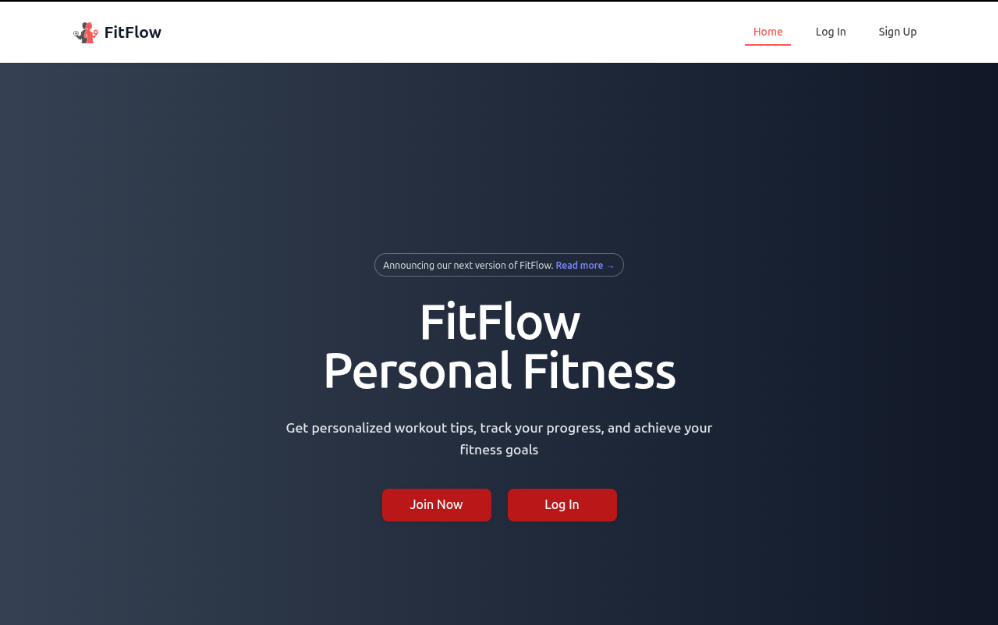
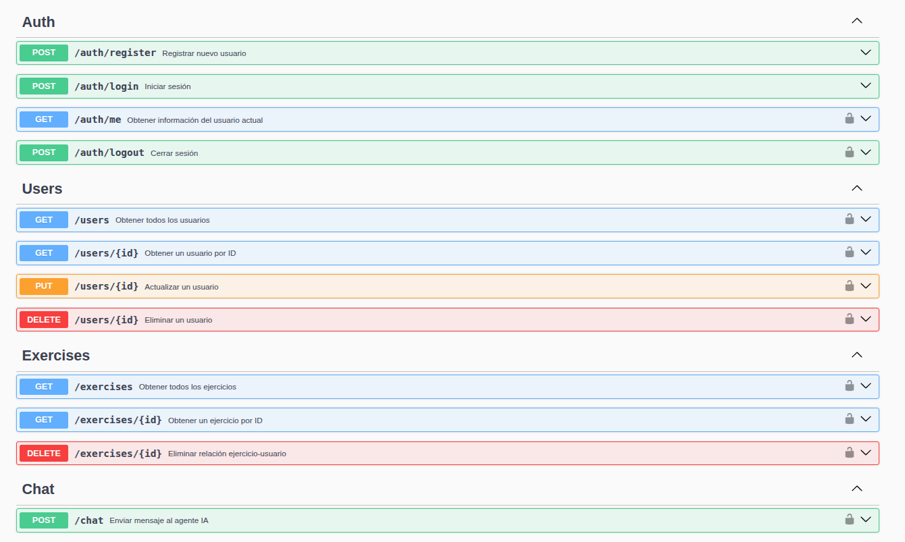
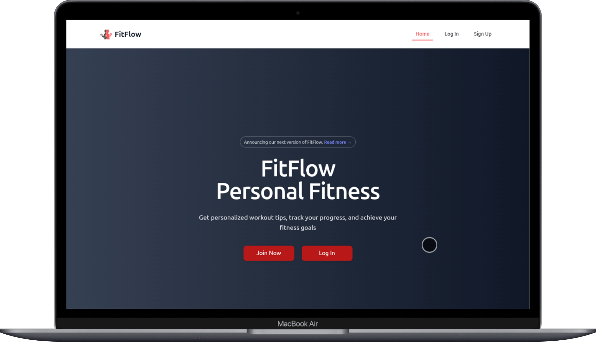
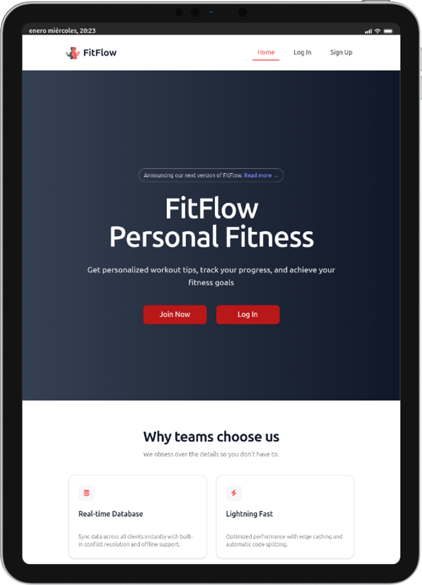
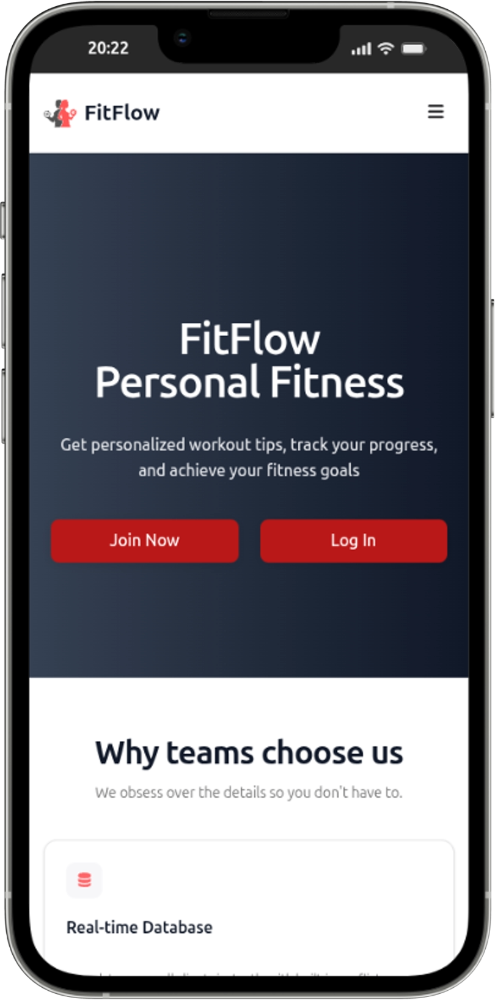
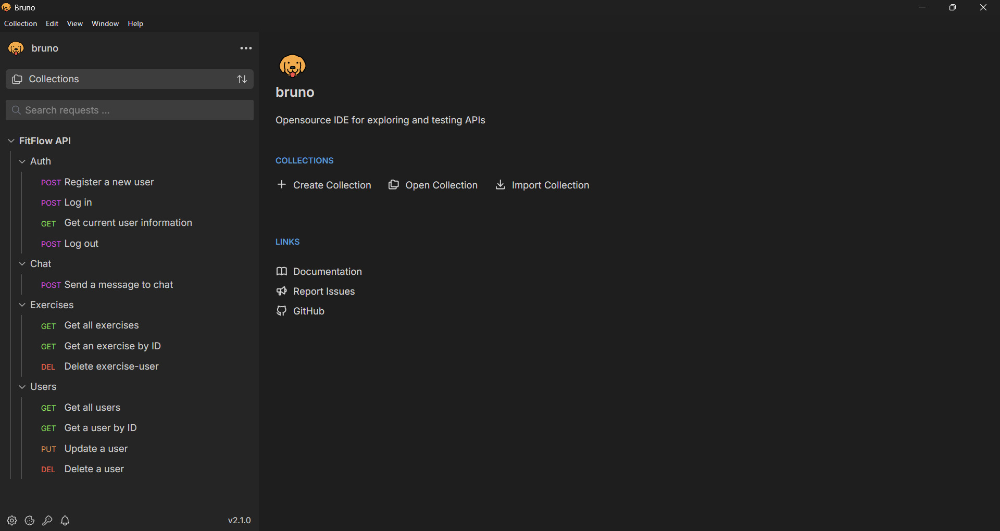

# 🏋️ FitFlow - AI Fitness Assistant

 

[](https://nextjs.org/) [](https://www.typescriptlang.org/) [](https://www.mongodb.com/) [](https://openai.com/)

📘 Also available in [Spanish](./README.es.md)

## 🎯 Overview

**FitFlow** is a fitness web application that combines artificial intelligence with a chat interface that provides personalized fitness exercise recommendations. Built with Next.js 16+, TypeScript, and utilizing OpenAI models, FitFlow offers an intelligent conversational experience for fitness enthusiasts of all levels.

The application leverages **RAG (Retrieval-Augmented Generation)** technology using Upstash Vector Database to provide accurate and contextualized exercise recommendations based on a comprehensive fitness dataset.

----------

## ✨ Features

#### 🤖 AI-Powered Chat Assistant

#### 💪 Exercise Database

#### 👤 User Management

#### 💬 Conversation Memory

#### 🎨 Modern UI/UX

## 🛠 Tech Stack

### Frontend

-   **Framework**: Next.js 16+ (App Router)
-   **Language**: TypeScript
-   **Styling**: Tailwind
-   **UI Components**: Custom component library with shadcn/ui
-   **State Management**: React Hooks
-   **HTTP Client**: Fetch API

### Backend

-   **Runtime**: Node.js
-   **Framework**: Express.js
-   **Language**: TypeScript
-   **Authentication**: JWT (JSON Web Tokens)
-   **Validation**: Zod Schemas

### Database & Storage

-   **Primary Database**: MongoDB (User data, messages, exercises)
-   **Vector Database**: Upstash Vector (RAG Embeddings)
-   **ODM**: Mongoose

### AI & Machine Learning

-   **LLM Provider**: OpenAI (GPT-4)
-   **RAG Implementation**: Custom implementation with Upstash
-   **Vector Embeddings**: OpenAI Embeddings API
-   **Agent Framework**: Custom AI agent with tool integration

### DevOps & Tools

-   **Package Manager**: pnpm
-   **Testing**: Jest
-   **API Testing**: Bruno
-   **API Documentation**: Swagger/OpenAPI
-   **Development**: Nodemon, TypeScript Compiler
-   **Code Quality**: ESLint, Prettier

----------

## 📁 Project Structure

### Backend

```
backend/
├── src/
│   ├── api/
│   │   ├── controllers/      # Business logic
│   │   ├── middlewares/      # Auth, validation, rate limiting
│   │   └── routes/           # Endpoint definitions
│   ├── config/               # Configurations (DB, OpenAI, CORS)
│   ├── models/               # Mongoose models
│   ├── schemas/              # Zod validation
│   ├── services/
│   │   ├── ai/              # AI agent and tools
│   │   └── rag/             # RAG implementation
│   ├── interfaces/          # TypeScript definitions
│   ├── types/               # Custom types
│   └── utils/               # Utility functions
├── tests/                   # Unit and integration tests
└── docs/                    # API documentation (Bruno, Swagger)

```

### Frontend

```
frontend/
├── app/
│   ├── (auth)/             # Authentication pages
│   │   ├── signin/
│   │   └── signup/
│   ├── (protected)/        # Protected pages
│   │   ├── chat/
│   │   ├── dashboard/
│   │   └── exercises/
│   ├── api/                # Next.js API routes
│   └── components/         # React components
│       ├── ai-elements/    # AI components
│       ├── auth/           # Auth forms
│       ├── chat/           # Chat components
│       └── ui/             # Reusable UI components
├── hooks/                  # Custom React hooks
├── lib/                    # Utilities and helpers
├── styles/                 # Global styles
└── types/                  # TypeScript types

```

----------

## 📦 Prerequisites

Before you begin, make sure you have installed:

-   **Node.js** (v16 or higher) - [Download](https://nodejs.org/)
-   **pnpm** (v8 or higher) - [Install](https://pnpm.io/installation)
-   **MongoDB** (v5 or higher) - [Install](https://www.mongodb.com/try/download/community)
-   **OpenAI Account** - [Sign up](https://platform.openai.com/)
-   **Upstash Account** - [Sign up](https://upstash.com/)

----------

## 🚀 Getting Started

### 1. Clone the Repository

```bash
git clone https://github.com/nuriadevs/fitflow-fullstack.git
cd fitflow-fullstack

```

### 2. Install Dependencies

```bash
# Install all dependencies
pnpm install

```

### 3. Configure Environment Variables

Create `.env` files in the `backend` and `frontend` folders:

#### Backend `.env`

```env
# Database
MONGODB_URI=your_mongodb_database_address

# Authentication
JWT_SECRET=your_super_secret_jwt_key_here

# OpenAI
OPENAI_API_KEY=sk-your_openai_api_key

# Upstash Vector Database
UPSTASH_VECTOR_REST_URL=https://your-endpoint.upstash.io
UPSTASH_VECTOR_REST_TOKEN=your_upstash_token

# Server
PORT=8000
NODE_ENV=development

# CORS
CORS_ORIGIN=http://localhost:3000

```

#### Frontend `.env.local`

```env
# API URL
NEXT_PUBLIC_API_URL=http://localhost:8000

```

### 4. Prepare the Database

```bash
# Make sure MongoDB is running
mongod

# Optional: Run seed script (if available)
cd backend
npm run seed

```

### 5. Initialize Vector Database (RAG)

```bash
cd backend
npm run ingest  # This ingests the exercise dataset into Upstash

```

### 6. Start the Application

#### Option A: Start both servers simultaneously

```bash
# From project root
pnpm dev

```

#### Option B: Start separately

```bash
# Terminal 1 - Backend
cd backend
npm start

# Terminal 2 - Frontend
cd frontend
pnpm dev

```

The application will be available at:

-   **Frontend**: [http://localhost:3000](http://localhost:3000/)
-   **Backend API**: [http://localhost:8000](http://localhost:8000/)
-   **API Docs**: [http://localhost:8000/docs](http://localhost:8000/api-docs)

## 📚 API Documentation

### Main Endpoints

**Authentication, exercises, users, chat**



## 🎬 Demo

#### Desktop



#### Tablet



#### Mobile



#### Backend API



### Frontend

**[📹 Watch Frontend Demo Video](https://youtu.be/HKG0sywPhEU)**

### Backend

**[📹 Watch Backend Demo Video](https://youtu.be/7JgR5SAsv9U)**

----------

## 🙏 Acknowledgments

-   [OpenAI](https://openai.com/) for GPT models and Embeddings
-   [Upstash](https://upstash.com/) for the vector database
-   [Vercel](https://vercel.com/) for Next.js
-   [MongoDB](https://www.mongodb.com/) for the database
-   Open source community for the amazing tools

## 📬 Contact

If you have questions, suggestions, or just want to chat about the project, send me a message.

[](mailto:nuriadevs@gmail.com)

----------

### ⭐ Like the project?

Give it a star on GitHub and share it!

[](https://github.com/nuriadevs/fitflow-fullstack) [](https://github.com/nuriadevs/fitflow-fullstack)
